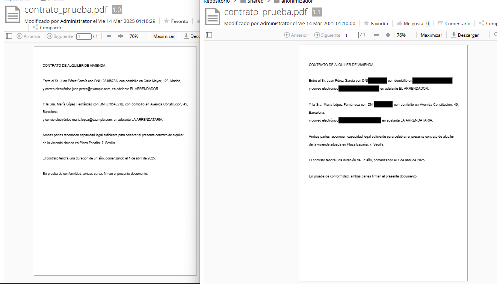

# 🤖 anonimization-ml-t-engine-alfrescoo

Anonimiza automáticamente documentos en Alfresco usando un T-Engine basado en Machine Learning con spaCy 🧠.

spaCy es un modelo de ML ligero pero potente, especializado en anonimización de documentos. Ten en cuenta las restricciones de memoria al desplegar el servicio 🚧.

## ⚙️ Cómo levantar el proyecto

Sigue estos pasos para desplegar la aplicación fácilmente:
```
git clone https://github.com/cparedesr/anonimization-ml-t-engine-alfresco.git
cd anonimization-ml-t-engine-alfresco
docker compose up --build
```

##  Configuración de la regla en Alfresco Share

La transformación de documentos PDF se activa con una sencilla regla de contenido en Alfresco:
```
Cuando: Se crean elementos o ingresan a esta carpeta
Si se cumplen todos los criterios: El tipo MIME es 'Documento Adobe PDF'
Realizar acción: Incrustar propiedades como metadatos en el contenido
```

##  🛠️ ¿Qué anonimiza este transformador?

En esta primera versión, el T-Engine anonimiza automáticamente:

DNI 📇

Direcciones 🏠

Correos electrónicos 📧

spaCy es altamente configurable, así que podrás agregar fácilmente más entidades según tus necesidades de anonimización 🔧.

El documento original queda almacenado en Alfresco como versión 1.0, mientras que el documento anonimizado se guarda como nueva versión 1.1 ✅.

## 🎯 Ejemplo de resultado

